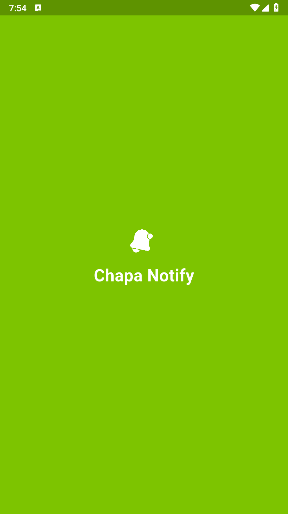
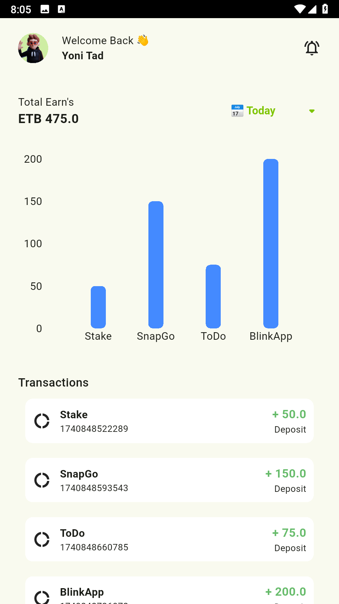

# Chapa Notify 🚀  

Chapa Notify is a **Flutter & Node.js-based** transaction notification system integrated with **GraphQL** and **MongoDB**. It enables users to **track, filter, and manage transactions** efficiently while offering a sleek UI and real-time updates.

## 📸 Screenshots  



## ✨ Features  
- **Real-time Transaction Tracking**  
- **GraphQL API with Mongoose**  
- **Filter Transactions by Date (Today, This Week, This Month, All Time)**  
- **Internet Connection Checker**

## 🔹 How It Works  
Chapa Notify is designed to track transactions under one Chapa account, but it categorizes payments based on their payment descriptions. This makes it super easy to manage multiple payments, whether you’re handling different services, products, or clients—all in one place! 📊✅ 

## 🛠 Tech Stack  
- **Frontend**: Flutter (Dart)  
- **Backend**: Node.js, GraphQL, MongoDB  


## 🚀 Setup Instructions  

### 1️⃣ Backend (Node.js)  
```bash
git clone https://github.com/yoni-tad/chapa-Notify.git
cd backend
npm install
npm start
```

Make sure to **set up your environment variables** (`.env` file):  
```ini
MONGO_URI=your_mongo_db_url
CHAPA_API_KEY=your_chapa_api_key
```

### 2️⃣ Frontend (Flutter)  
```bash
cd frontend
flutter pub get
flutter run
```


## 📌 API Endpoints (GraphQL Playground)  
- `getTransactions(filter: String)` → Fetch transactions based on a filter  
- `subscribeTransactions` → Real-time updates for new transactions  


## 🎉 Contributions  
Feel free to **fork, contribute, or open issues**!  


## 📄 License  
This project is **open-source** under the MIT License.  


---

💡 **Developed by Yoni Tad**  
🚀 _Made with 💙 using Flutter & Node.js_
